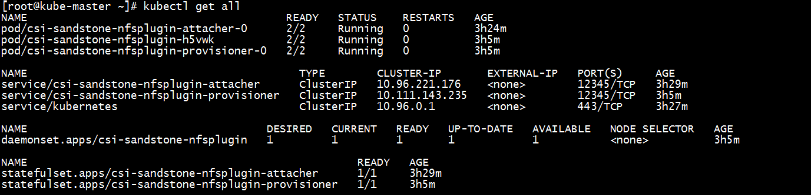
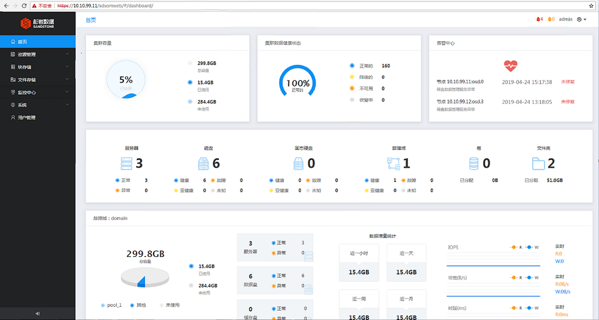
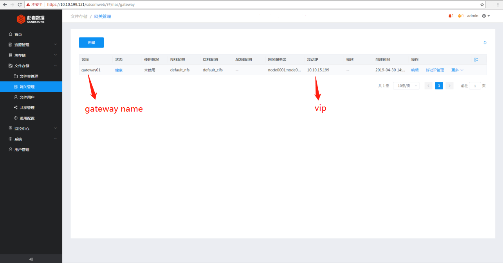
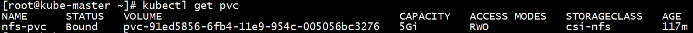
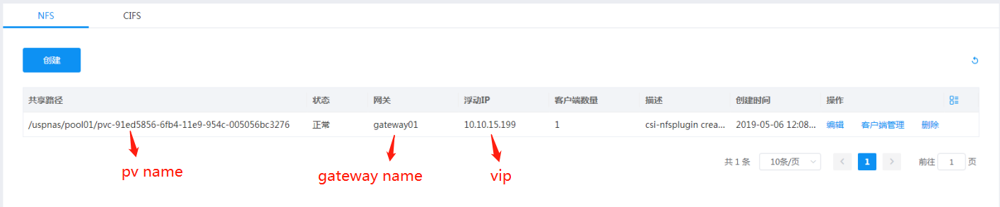

# SandStone CSI 1.0.0

[Container Storage Interface (CSI)](https://github.com/container-storage-interface/) driver, provisioner, and attacher for SandStone Block/NFS/ISCSI.

## Overview

SandStone CSI plugins implement an interface between CSI enabled Container Orchestrator (CO) and SandStone cluster. It allows dynamically provisioning SandStone volumes and attaching them to workloads. Current implementation of SandStone CSI plugins was tested in Kubernetes environment (requires Kubernetes 1.11+), but the code does not rely on any Kubernetes specific calls (WIP to make it k8s agnostic) and should be able to run with any CSI enabled CO.

For details about configuration and deployment of NFS CSI plugins, please refer the documentation.

For example usage of this NFS CSI plugins, see examples below.


Before to go,  you should have installed [SandStone USP](http://www.szsandstone.com)

You can get latest version of SandStone CSI driver at [docker hub](https://hub.docker.com/r/szsandstone/) 

# Deployment

In this section，you will learn how to deploy the CSI driver and some necessary sidecar containers

## Prepare cluster ##

| Cluster | version |
| ----------| --------------|
| Kubernetes | 1.13 + |
| SandStone USP | 3.0+          |


## Deploy CSI plugins

### Plugins
#### Get yaml file

Get yaml file from below links:

- [csi-attacher-rbac.yaml](./deploy/nfs/kubernetes/csi-attacher-rbac.yaml)
- [csi-nodeplugin-rbac.yaml](./deploy/nfs/kubernetes/csi-nodeplugin-rbac.yaml)
- [csi-provisioner-rbac.yaml](./deploy/nfs/kubernetes/csi-provisioner-rbac.yaml)
- [csi-sandstone-nfsplugin.yaml](./deploy/nfs/kubernetes/csi-sandstone-nfsplugin.yaml)
- [csi-sandstone-nfsplugin-attacher.yaml](./deploy/nfs/kubernetes/csi-sandstone-nfsplugin-attacher.yaml)
- [csi-sandstone-nfsplugin-provisioner.yaml](./deploy/nfs/kubernetes/csi-sandstone-nfsplugin-provisioner.yaml)

#### Create sidecar（Helper container）& node plugin

1. Deploy RBACs for sidecar containers and node plugins:

   ```shell
   $ kubectl create -f csi-attacher-rbac.yaml
   $ kubectl create -f csi-nodeplugin-rbac.yaml
   $ kubectl create -f csi-provisioner-rbac.yaml
   ```

2. Deploy CSI sidecar containers:

   ```shell
   $ kubectl create -f csi-sandstone-nfsplugin-attacher.yaml
   $ kubectl create -f csi-sandstone-nfsplugin-provisioner.yaml
   ```

3. Deploy NFS CSI driver:

   ```shell
   $ kubectl create -f csi-sandstone-nfsplugin.yaml
   ```

4. Verify pod:

   ```shell
   $ kubectl get all
   ```

    

Congratulation to you, you have just finished the deployment. Now you can use them to provisioning SandStone NFS service .

# 				Usage
In this section，you will learn how to dynamic provision NFS with SandStone CSI driver. Here will Assumes that you have installed SandStone USP Cluster.


## Preparation

To continue，make sure you have finish the Deployment part.

Login to you SDS dashboard, your dashboard address should be `https://your_domain_ip`



### Creating NFS Gateway



### Edit yaml for StorageClass

#### Sample(storageclass.yaml) & Explanation

```shell
apiVersion: storage.k8s.io/v1
kind: StorageClass
metadata:
   name: csi-nfs
provisioner: csi-sandstone-nfsplugin
parameters:

    omip: 10.10.199.121    #om dashboard ip
    
    pool: pool01           #name of storage pool 
    
    gateway: gateway01     #name of nfs gateway 
    
    vip: 10.10.15.199      #vip
    
    omuser: admin          #om user name
    
    omsecret: 123456       #om password
```

### Create storageclass

```shell
$ kubectl create -f storageclass.yaml
```

### Edit yaml for PersistentVolumeClaim

#### Sample(pvc.yaml) 

```shell
apiVersion: v1
kind: PersistentVolumeClaim
metadata:
  name: nfs-pvc
spec:
  accessModes:
  - ReadWriteOnce
  resources:
    requests:
      storage: 5Gi
  storageClassName: csi-nfs
```

### Create pvc

```shell
$ kubectl create -f pvc.yaml
```

#### Verify 

- Run kubectl check command

  ```shell
  $ kubectl get pvc
  ```
  

- Check at om dashboard

  

### Edite yaml for pod

#### sample(pod.yaml)

```shell
apiVersion: v1
kind: Pod
metadata:
  name: nginx-nfs-csi-demo-pod
spec:
  containers:
  - image: nginx
    imagePullPolicy: IfNotPresent
    name: nginx
    ports:
    - containerPort: 80
      protocol: TCP
    volumeMounts:
      - mountPath: /usr/share/nginx/html
        name: data-nfsplugin 
  volumes:
  - name: data-nfsplugin
    persistentVolumeClaim:
      claimName: nfs-pvc
```

### Create pod

```shell
$ kubectl create -f pod.yaml
```


#### Verify pod

```shell
  $ kubectl get pods | grep nginx-nfs-csi-demo-pod
```


